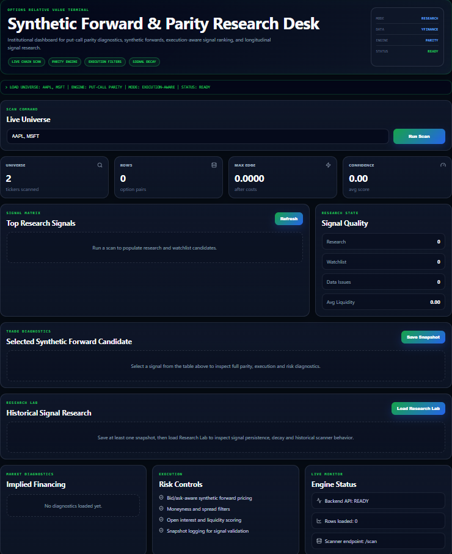

Execution-Aware Options Relative Value Research Platform

A full-stack options research platform for analyzing put-call parity deviations, synthetic forward pricing, implied financing, execution-aware signal quality, and signal persistence over time.

The system combines a Python quantitative engine, a FastAPI backend, and a React frontend designed as an institutional-style options research terminal.
## Screenshot

Tech Stack
Python
FastAPI
React
Vite
Pandas
yfinance
Streamlit prototype
Local CSV snapshot storage
Overview

This project scans listed option chains across a user-defined equity universe and evaluates potential relative-value dislocations using put-call parity.

Core pricing relationship:

C - P = S * exp(-qT) - K * exp(-rT)

Where:

C = call option price
P = put option price
S = spot price
K = strike price
r = risk-free rate
q = dividend yield
T = time to expiration

The platform evaluates synthetic forward trades using execution-aware bid/ask logic:

Buy synthetic forward  = buy call at ask, sell put at bid
Sell synthetic forward = sell call at bid, buy put at ask

The goal is not to claim executable arbitrage from retail data. The goal is to build a disciplined research workflow for detecting, filtering, and studying potential options relative-value signals.

Key Features
Multi-ticker option chain scanning
Put-call parity diagnostics
Synthetic forward pricing
Bid/ask-aware execution logic
Implied financing rate estimation
Implied dividend yield estimation
Liquidity scoring
Confidence scoring
Data-quality filtering
Moneyness filters
Spread and open interest filters
Snapshot logging
Signal decay analysis
Signal persistence scoring
Trade diagnostics panel
React-based institutional dashboard
FastAPI backend connected to the Python quant engine
Project Structure
option_parity_scanner/
│
├── scanner.py
│   Core quantitative engine for put-call parity, synthetic forward pricing,
│   implied financing, data-quality filters, liquidity scoring, and signal generation.
│
├── research.py
│   Research layer for saving snapshots, loading historical data,
│   signal decay analysis, persistence scoring, and research summaries.
│
├── app.py
│   Streamlit prototype used during early development.
│
├── backend/
│   ├── __init__.py
│   └── api.py
│       FastAPI backend exposing scanner and research endpoints.
│
├── frontend/
│   React/Vite frontend dashboard.
│
├── data_logs/
│   Local snapshot storage for research history.
│
├── requirements.txt
├── .gitignore
└── README.md
Architecture
React Frontend
      ↓
FastAPI Backend
      ↓
Python Quant Engine
      ↓
yfinance option-chain data
      ↓
Research snapshots and historical signal analysis

The frontend communicates with the backend through HTTP endpoints.

The backend calls the Python scanner and research modules.

Snapshots are stored locally as CSV files for longitudinal analysis.

Backend API

The backend exposes three primary endpoints:

GET /health
POST /scan
GET /research/summary
GET /health

Checks whether the backend is online.

Example response:

{
  "status": "online",
  "engine": "put-call-parity",
  "mode": "research"
}
POST /scan

Runs the options scanner for a given universe.

Example request:

{
  "tickers": ["AAPL", "MSFT", "NVDA"],
  "scan_mode": "single",
  "max_expiries_per_ticker": 1,
  "risk_free_rate": 0.05,
  "dividend_yield": 0.005,
  "stock_slippage_bps": 2.0,
  "min_net_edge": 0.05,
  "max_total_spread": 1.0,
  "min_open_interest": 500,
  "min_liquidity_score": 50,
  "min_edge_to_spread": 0.5,
  "min_total_spread_floor": 0.05,
  "max_moneyness_deviation": 0.2,
  "min_option_bid": 0.01,
  "save_snapshot": false
}
GET /research/summary

Loads historical snapshots and returns research analytics such as signal decay and persistence.

How to Run
1. Clone the repository
git clone <your-repo-url>
cd option_parity_scanner
2. Create and activate a Python virtual environment

Windows PowerShell:

python -m venv .venv
.venv\Scripts\activate
3. Install Python dependencies
pip install -r requirements.txt
4. Start the backend

From the project root:

uvicorn backend.api:app --reload

Backend:

http://127.0.0.1:8000

API documentation:

http://127.0.0.1:8000/docs
5. Start the frontend

Open a second terminal:

cd frontend
npm install
npm run dev

Frontend:

http://localhost:5173
Streamlit Prototype

The project also includes the original Streamlit prototype:

streamlit run app.py

The Streamlit version was used to prototype the research workflow before building the React/FastAPI full-stack version.

Research Workflow

The intended workflow is:

1. Define universe
2. Run live option-chain scan
3. Rank synthetic forward parity signals
4. Inspect trade diagnostics
5. Save research snapshot
6. Load Research Lab
7. Analyze signal decay and persistence

This workflow is designed to separate one-off noisy market data from recurring signal behavior.

Important Limitations

This project uses publicly available option-chain data through yfinance.

The output should not be interpreted as directly executable arbitrage.

Important limitations include:

Delayed or stale option quotes
Wide bid/ask spreads
Incomplete open interest or volume data
Dividend assumptions may be simplified
Borrow costs are not modeled
Early exercise risk is not fully modeled
Execution latency is not modeled
Transaction costs may be underestimated
Professional market data would be required for production use

The platform should be viewed as a research tool, not an automated trading system.

Why This Project Matters

Put-call parity is a foundational no-arbitrage relationship in options pricing.

In real markets, that relationship is affected by bid/ask spreads, liquidity constraints, dividends, funding costs, borrow costs, execution risk, and quote quality.

This project turns a theoretical pricing relationship into an execution-aware research workflow.

It does not simply search for apparent mispricing. It attempts to classify whether a signal is potentially meaningful, liquid, persistent, and worth further research.

Future Improvements

Potential next steps:

Connect to professional options data
Add real dividend schedule handling
Add borrow-cost assumptions
Add volatility surface diagnostics
Add Greeks
Add Black-Scholes theoretical pricing
Add historical options database
Add user-controlled filters in React
Add authentication
Add Docker setup
Add automated tests
Add deployment configuration
Positioning

This project is best described as:

An execution-aware options relative-value research platform.

Not:

A guaranteed arbitrage scanner.

The goal is to demonstrate quantitative research thinking, options market structure awareness, full-stack engineering ability, and disciplined handling of noisy financial data.